# 🍬 Sweet Shop - Full Stack E-Commerce Application

A modern, full-featured e-commerce application for a sweet shop built with **React** (Frontend) and **Node.js/Express** (Backend). This application provides a complete shopping experience with user authentication, product management, inventory tracking, and an admin dashboard.

---

## 🌐 Live Demo

| Platform | URL |
|----------|-----|
| **Frontend** | [https://sweetshop-beta.vercel.app](https://sweetshop-beta.vercel.app) |
| **Backend API** | [https://sweet-shop-fawn.vercel.app](https://sweet-shop-fawn.vercel.app/api/health) |

---

## 📋 Table of Contents

- [Features](#-features)
- [Screenshots](#-screenshots)
- [Tech Stack](#-tech-stack)
- [Project Structure](#-project-structure)
- [Getting Started](#-getting-started)
- [Environment Variables](#-environment-variables)
- [Available Scripts](#-available-scripts)
- [API Endpoints](#-api-endpoints)
- [Components](#-components)
- [Authentication](#-authentication)
- [Admin Features](#-admin-features)
- [Categories](#-categories)
- [Testing](#-testing)
- [My AI Usage](#-my-ai-usage)
- [Contributing](#-contributing)
- [Contact](#-contact)
- [License](#-license)

---

## ✨ Features

### 👤 User Features

| Feature | Description |
|---------|-------------|
| 🔐 Authentication | User registration and login |
| 🛒 Browse & Search | Find sweets by name, category, and price |
| 📦 Purchase | Buy sweets with quantity selection |
| 📱 Responsive | Fully optimized for mobile and desktop |

### 🔧 Admin Features

| Feature | Description |
|---------|-------------|
| 📊 Dashboard | Inventory overview and statistics |
| ➕ Product CRUD | Add, edit, and delete products |
| 📈 Restock | Replenish inventory quantities |
| ⚠️ Alerts | Low stock notifications |
| 📋 Management | Product table with full controls |

### ⚙️ Backend Features

| Feature | Description |
|---------|-------------|
| 🔒 JWT Auth | Token-based authentication |
| 🛡️ RBAC | Role-based access control (User/Admin) |
| 🔑 Security | Password hashing with bcrypt |
| 📝 Validation | Input validation with express-validator |
| 🚨 Error Handling | Comprehensive logging and responses |
| 🌐 CORS | Cross-origin resource sharing support |
| ❤️ Health Check | API status monitoring endpoint |

### 🎯 General Features

| Feature | Description |
|---------|-------------|
| 🎨 Modern UI | Clean design with Tailwind CSS |
| 🔔 Notifications | Toast alerts for user feedback |
| 🔒 Protected Routes | Secure pages for authenticated users |
| 🎯 Access Control | Role-based feature restrictions |

---

## 📸 Screenshots

### 🏠 Home Page

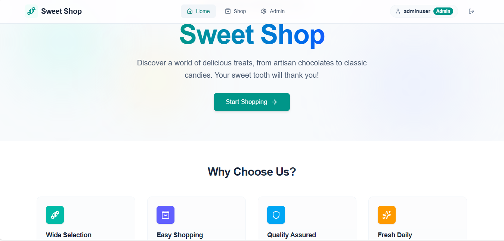

*Home page introducing the company*

---

### 🔐 User Authentication

| Login | Register |
|:-----:|:--------:|
| 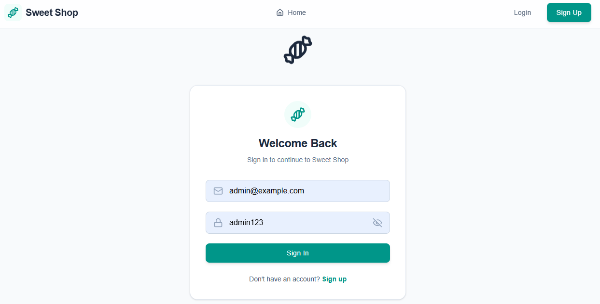 | 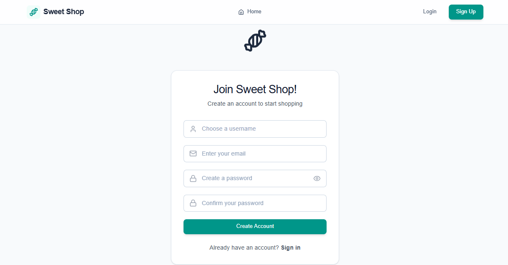 |

---

### 🍭 User Dashboard

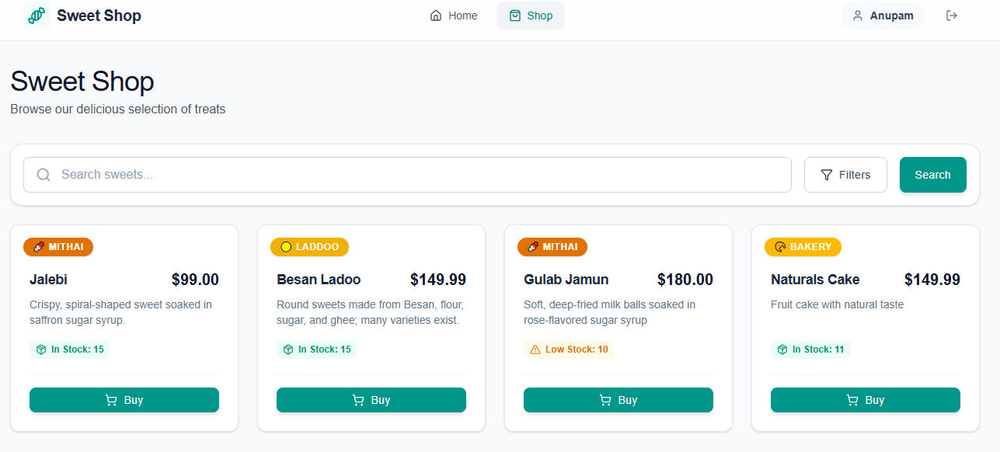

*Browse all available sweets with search and filter functionality*

---

### 🛒 Purchase Modal

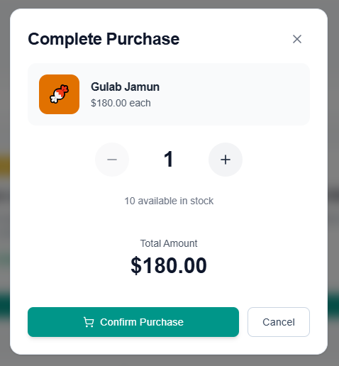

*Select quantity and complete purchase*

---

### 📊 Admin Dashboard

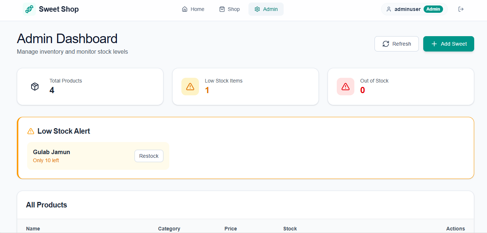

*Admin overview with inventory statistics and low stock alerts*

---

### 📦 Product Management

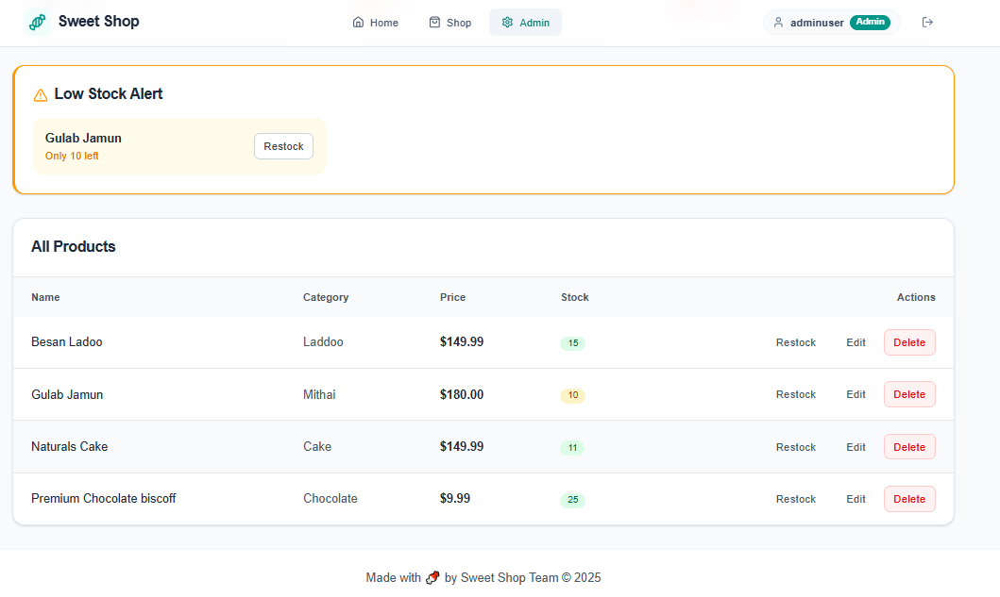

*Add, edit, and delete products from the admin panel*

---

### ➕ Add/Edit Product Form

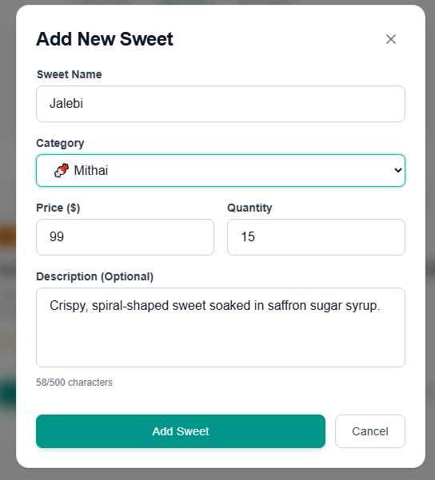

*Form for creating and updating sweet products*

---

### 📈 Restock Modal

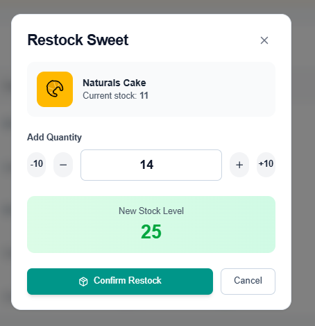

*Admin can restock inventory*

---

### 🔍 Search Functionality

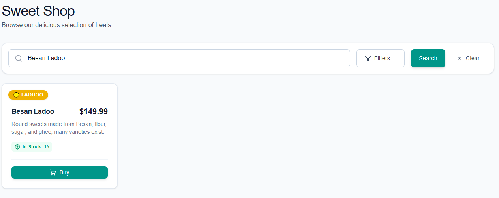

*Search sweets by name*

---

### 📱 Mobile Responsive View

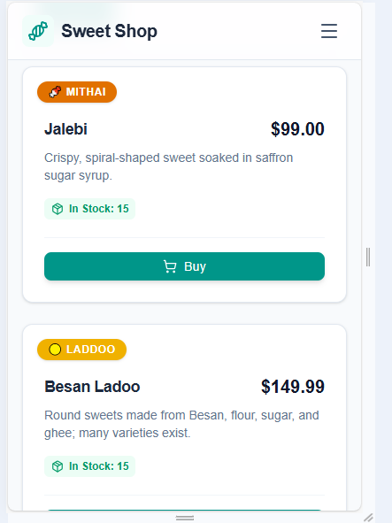

*Fully responsive design for mobile devices*

---

## 🛠 Tech Stack

### Frontend

| Technology | Purpose |
|:----------:|---------|
|  | Frontend Framework |
|  | Client-side Routing |
|  | Styling |
|  | Build Tool |
| Lucide React | Icons |
| Axios | HTTP Client |
| React Hot Toast | Notifications |

### Backend

| Technology | Purpose |
|:----------:|---------|
|  | Runtime Environment |
|  | Web Framework |
|  | Database |
|  | Authentication |
| Mongoose | ODM (Object Data Modeling) |
| bcryptjs | Password Hashing |
| express-validator | Input Validation |
| Jest & Supertest | Testing |
| mongodb-memory-server | Test Database |

---

## 📁 Project Structure

<details>
<summary><b>📂 Frontend Structure</b></summary>

```
frontend/
├── src/
│   ├── components/
│   │   ├── auth/
│   │   │   ├── LoginForm.jsx
│   │   │   ├── RegisterForm.jsx
│   │   │   └── ProtectedRoute.jsx
│   │   ├── common/
│   │   │   ├── Button.jsx
│   │   │   ├── Input.jsx
│   │   │   ├── Loading.jsx
│   │   │   ├── Modal.jsx
│   │   │   └── Select.jsx
│   │   ├── layout/
│   │   │   ├── Layout.jsx
│   │   │   └── Navbar.jsx
│   │   └── sweets/
│   │       ├── PurchaseModal.jsx
│   │       ├── RestockModal.jsx
│   │       ├── SearchFilter.jsx
│   │       ├── SweetCard.jsx
│   │       ├── SweetForm.jsx
│   │       ├── SweetList.jsx
│   │       └── SweetModal.jsx
│   ├── context/
│   │   └── AuthContext.jsx
│   ├── hooks/
│   │   ├── useAuth.js
│   │   └── useSweets.js
│   ├── pages/
│   │   ├── AdminPage.jsx
│   │   ├── DashboardPage.jsx
│   │   ├── HomePage.jsx
│   │   ├── LoginPage.jsx
│   │   └── RegisterPage.jsx
│   ├── services/
│   │   └── api.js
│   ├── utils/
│   │   └── constants.js
│   ├── App.jsx
│   ├── main.jsx
│   └── index.css
├── .env
├── package.json
└── vite.config.js
```

</details>

<details>
<summary><b>📂 Backend Structure</b></summary>

```
backend/
├── src/
│   ├── config/
│   │   └── db.js                  # MongoDB connection
│   ├── controllers/
│   │   ├── authController.js      # Auth logic
│   │   ├── sweetController.js     # Product operations
│   │   └── inventoryController.js # Inventory operations
│   ├── middleware/
│   │   ├── authMiddleware.js      # JWT and role checks
│   │   └── errorMiddleware.js     # Error handling
│   ├── models/
│   │   ├── User.js                # User schema
│   │   └── Sweet.js               # Product schema
│   ├── routes/
│   │   ├── authRoutes.js
│   │   ├── sweetRoutes.js
│   │   └── inventoryRoutes.js
│   ├── validators/
│   │   └── validators.js          # Validation rules
│   ├── app.js                     # Express app setup
│   └── server.js                  # Entry point
├── tests/
│   ├── setup.js
│   ├── auth.test.js
│   ├── sweets.test.js
│   └── inventory.test.js
├── .env
└── package.json
```

</details>

---

## 🚀 Getting Started

### Prerequisites

Before you begin, ensure you have the following installed:

- ✅ **Node.js** (v16 or higher)
- ✅ **npm** or **yarn**
- ✅ **MongoDB** (local installation or MongoDB Atlas account)

---

### ⚙️ Backend Installation

```bash
# 1. Clone the repository
git clone https://github.com/AnupamNeon/SweetShop.git
cd SweetShop/backend

# 2. Install dependencies
npm install

# 3. Set up environment variables
cp .env.example .env
# Edit .env and add your MongoDB URI and JWT secret

# 4. Start the development server
npm run dev

# 5. Verify the API
curl http://localhost:3000/api/health
```

---

### 💻 Frontend Installation

```bash
# 1. Navigate to frontend directory
cd ../frontend

# 2. Install dependencies
npm install

# 3. Set up environment variables
cp .env.example .env
# Edit .env and add your API URL

# 4. Start the development server
npm run dev

# 5. Open your browser
# Navigate to http://localhost:5173
```

---

## 🔧 Environment Variables

### Backend (`.env`)

```env
PORT=3000
NODE_ENV=development
MONGODB_URI=mongodb://localhost:27017/sweetshop
JWT_SECRET=your_super_secret_jwt_key_here
JWT_EXPIRE=7d
```

| Variable | Description | Required | Default |
|----------|-------------|:--------:|---------|
| `PORT` | Server port | ❌ | `3000` |
| `NODE_ENV` | Environment mode | ❌ | `development` |
| `MONGODB_URI` | MongoDB connection string | ✅ | - |
| `JWT_SECRET` | Secret for JWT signing | ✅ | - |
| `JWT_EXPIRE` | JWT expiration time | ❌ | `7d` |

### Frontend (`.env`)

```env
VITE_API_URL=http://localhost:3000
```

| Variable | Description | Default |
|----------|-------------|---------|
| `VITE_API_URL` | Backend API base URL | `http://localhost:3000` |

---

## 📜 Available Scripts

### Backend Scripts

| Command | Description |
|---------|-------------|
| `npm run dev` | Start development server with nodemon |
| `npm start` | Start production server |
| `npm test` | Run test suite |
| `npm run test:watch` | Run tests in watch mode |

### Frontend Scripts

| Command | Description |
|---------|-------------|
| `npm run dev` | Start development server |
| `npm run build` | Build for production |
| `npm run preview` | Preview production build |
| `npm run lint` | Run ESLint |

---

## 🔌 API Endpoints

> **Base URL:** All routes are prefixed with `/api`

### ❤️ Health Check

| Method | Endpoint | Description |
|:------:|----------|-------------|
| `GET` | `/api/health` | Check API status |

### 🔐 Authentication

| Method | Endpoint | Description |
|:------:|----------|-------------|
| `POST` | `/api/auth/register` | Register new user |
| `POST` | `/api/auth/login` | Login user |
| `GET` | `/api/auth/me` | Get current user |
| `POST` | `/api/auth/logout` | Logout user |

### 🍬 Sweets (Products)

| Method | Endpoint | Description | Auth |
|:------:|----------|-------------|:----:|
| `GET` | `/api/sweets` | Get all sweets (paginated) | ❌ |
| `GET` | `/api/sweets/:id` | Get sweet by ID | ❌ |
| `GET` | `/api/sweets/search` | Search sweets | ❌ |
| `POST` | `/api/sweets` | Create new sweet | 🔒 Admin |
| `PUT` | `/api/sweets/:id` | Update sweet | 🔒 Admin |
| `DELETE` | `/api/sweets/:id` | Delete sweet | 🔒 Admin |

### 📦 Inventory

| Method | Endpoint | Description | Auth |
|:------:|----------|-------------|:----:|
| `POST` | `/api/sweets/:id/purchase` | Purchase sweet | ✅ |
| `POST` | `/api/sweets/:id/restock` | Restock sweet | 🔒 Admin |
| `GET` | `/api/inventory/low-stock` | Get low stock items | 🔒 Admin |

### 🔑 Protected Routes Header

```http
Authorization: Bearer <your_jwt_token>
```

---

## 🧩 Components

### Common Components

| Component | Description |
|-----------|-------------|
| `Button` | Reusable button with variants (primary, secondary, danger, ghost) |
| `Input` | Form input with label and error handling |
| `Select` | Dropdown select component |
| `Modal` | Reusable modal dialog |
| `Loading` | Loading spinner with optional fullscreen mode |

### Sweet Components

| Component | Description |
|-----------|-------------|
| `SweetCard` | Product card displaying sweet details |
| `SweetList` | Grid of sweet cards |
| `SweetForm` | Form for creating/editing sweets |
| `SweetModal` | Modal wrapper for sweet form |
| `PurchaseModal` | Modal for purchasing sweets |
| `RestockModal` | Modal for restocking inventory |
| `SearchFilter` | Search and filter controls |

---

## 🔐 Authentication

The app uses **JWT-based authentication**:

| Feature | Implementation |
|---------|----------------|
| **Token Storage** | JWT tokens stored in `localStorage` |
| **Auto-logout** | Automatic logout on 401 responses |
| **Protected Routes** | `ProtectedRoute` component guards authenticated pages |
| **Role-based Access** | `adminOnly` prop restricts routes to admin users |

### 👥 User Roles

| Role | Permissions |
|:----:|-------------|
| `user` | Browse, search, purchase sweets |
| `admin` | All user permissions + CRUD operations, restock |

---

## 👨‍💼 Admin Features

### 📊 Dashboard Overview

| Metric | Description |
|--------|-------------|
| Total Products | Count of all products |
| Low Stock Items | Items below threshold (10) |
| Out of Stock | Items with zero quantity |

### 📦 Product Management

- ➕ Add new sweets with name, category, price, quantity, and description
- ✏️ Edit existing products
- 🗑️ Delete products
- 📋 View all products in a table format

### 📈 Inventory Management

- 🔄 Restock products with custom quantities
- ⚠️ Low stock alerts (threshold: 10 items)
- ⚡ Quick restock from alert panel

---

## 🎨 Categories

| Category | Display | Category | Display |
|----------|---------|----------|---------|
| `mithai` | 🍬 Mithai | `chocolate` | 🍫 Chocolate |
| `milk-sweets` | 🥛 Milk Sweets | `bakery` | 🥐 Bakery |
| `laddoo` | 🟡 Laddoo | `namkeen` | 🥨 Namkeen |
| `halwa` | 🍮 Halwa | `ice-cream` | 🍦 Ice Cream |
| `barfi` | 🔷 Barfi | `dry-fruit` | 🥜 Dry Fruit |
| | | `other` | 🍭 Other |

---

## 🧪 Testing

Run the test suite:

```bash
cd backend
npm test
```

### ✅ Test Coverage

| Category | Tests |
|----------|-------|
| Authentication | Register, login, protected routes |
| Product CRUD | Create, read, update, delete operations |
| Inventory | Purchase, restock functionality |
| Access Control | Role-based restrictions |

> Tests use **Jest**, **Supertest**, and an **in-memory MongoDB server** for isolation.

---

## 🤖 My AI Usage

### AI Tools Used

| AI Tool | Primary Use Case |
|---------|------------------|
| **ChatGPT (GPT-5.2)** | Architecture planning, project structure, code review, debugging |
| **Claude (Anthropic)** | Documentation writing, code explanation, boilerplate generation |

---

### 💡 How I Used Each Tool

<details>
<summary><b>🔷 ChatGPT (GPT-5.2)</b></summary>

#### API Endpoint Structure Design

> *"I used ChatGPT to brainstorm and design the RESTful API endpoint structure for the sweet shop. I provided the requirements (authentication, product management, inventory) and asked for suggestions on organizing routes, choosing HTTP methods, and structuring response formats according to industry standards."*

**Example Prompt:**
```
"I'm building a sweet shop API. I need endpoints for user authentication, 
product CRUD operations, and inventory management. Can you suggest a 
RESTful API structure with proper HTTP methods and route naming conventions?"
```

#### Database Schema Design

> *"I consulted ChatGPT to design the MongoDB schemas for User and Sweet models. It helped me decide on field types, validation rules, and relationships between collections."*

#### Error Handling Patterns

> *"I asked ChatGPT to review my error handling middleware and suggest improvements for consistent error responses across the API."*

</details>

<details>
<summary><b>🟣 Claude (Anthropic)</b></summary>

#### Boilerplate Code Generation

> *"I used Claude extensively for generating repetitive boilerplate code, especially for React components and Express route handlers. It significantly speed up the creation of similar components like modal dialogs and form inputs."*

#### Unit Test Generation

> *"I asked Claude to generate unit tests for my service layer. After writing the first test case manually, it suggested subsequent test cases following the same pattern."*

#### Specific Examples:

- ✅ Generated the basic structure for all CRUD controller functions
- ✅ Auto-completed Mongoose query methods
- ✅ Suggested Tailwind CSS classes for responsive design
- ✅ Helped write validation schemas for express-validator

#### Documentation Writing

> *"I used Claude to help structure and write comprehensive documentation, including this README file. I provided the project details and asked for suggestions on organizing the documentation sections."*

</details>

---

### 📊 Detailed Usage Breakdown

| Task | AI Tool | How It Helped |
|------|---------|---------------|
| Initial project planning | ChatGPT | Suggested folder structure and architecture patterns |
| MongoDB schema design | ChatGPT | Recommended field types and indexing strategies |
| Express middleware setup | ChatGPT | Auto-completed middleware boilerplate |
| React component creation | Claude | Generated component structure and props |
| Tailwind styling | Claude | Suggested responsive utility classes |
| JWT implementation | ChatGPT | Explained token handling best practices |
| Test case writing | ChatGPT | Generated test templates after initial examples |
| API documentation | Claude | Structured endpoint documentation |
| Error handling | ChatGPT | Suggested centralized error handling approach |
| README creation | Claude | Organized and formatted project documentation |

---

### 📈 Reflection on AI Impact

<details>
<summary><b>✅ Positive Impacts</b></summary>

| Impact | Description |
|--------|-------------|
| ⏱️ **Speed** | Tasks that typically took 30 minutes were completed in under 5 minutes |
| 📚 **Learning** | ChatGPT served as an on-demand tutor for unfamiliar concepts |
| 🐛 **Debugging** | AI tools reduced debugging time by approximately 40% |
| 📝 **Documentation** | Claude helped create more comprehensive documentation |
| 🎨 **Design Patterns** | Introduced patterns like repository pattern and custom hooks |

</details>

<details>
<summary><b>⚠️ Challenges & Limitations</b></summary>

| Challenge | Description |
|-----------|-------------|
| 🔍 **Code Review Essential** | AI-generated code sometimes contained subtle bugs |
| 📖 **Context Limitations** | AI occasionally lost context in long conversations |
| 🔄 **Outdated Suggestions** | Some suggestions referenced deprecated libraries |
| ⚠️ **Over-reliance Risk** | Had to balance AI assistance with personal problem-solving |

</details>

---

### 📊 Quantitative Impact

| Metric | Improvement |
|--------|:-----------:|
| Development Time | ~35% faster |
| Debugging Time | ~40% reduction |
| Documentation Quality | Significantly improved |
| Test Coverage | ~25% more comprehensive |
| Code Consistency | More uniform patterns |

---

### ✅ Ethical Considerations

- ✅ All AI-generated code was reviewed, understood, and modified as needed
- ✅ No AI-generated content was submitted without proper understanding
- ✅ AI tools were used as learning aids and productivity enhancers
- ✅ Original thought and problem-solving remained central to the development process

---

## 🤝 Contributing

Contributions are welcome! Please follow these steps:

```bash
# 1. Fork the repository

# 2. Create a feature branch
git checkout -b feature/AmazingFeature

# 3. Commit your changes
git commit -m 'Add some AmazingFeature'

# 4. Push to the branch
git push origin feature/AmazingFeature

# 5. Open a Pull Request
```

### 📝 Guidelines

- ✅ Follow existing code style and conventions
- ✅ Write tests for new features
- ✅ Update documentation as needed

---

## 📞 Contact

**Anupam Kumar**

[](https://github.com/AnupamNeon)
[](mailto:anupammaurya84377@gmail.com)

---

<div align="center">

**Made with ❤️ by [Anupam Kumar](https://github.com/AnupamNeon)**

⭐ Star this repository if you found it helpful!

</div>